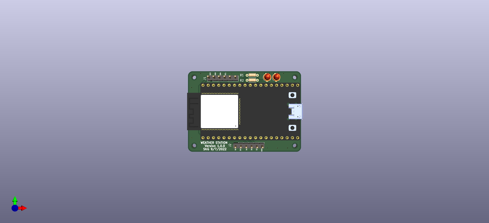

# ESP32 - Weather Station PCB

Simple PCB with through hole components which can integrate easily environmental sensors (bme320,sht40) and implement a simple weather station . The initial design was based on ESP-32 Dev Kit . The PCB is supplied through the USB port of the ESP-32 Dev Kit.

 